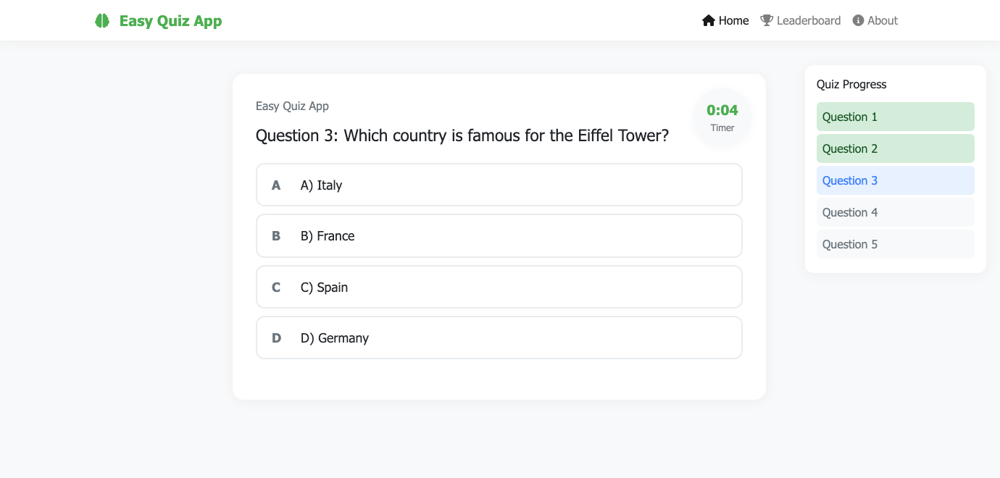

# Java Quiz Web Application

This is a simple Java-based web application for a quiz game where users can answer 5 random questions each time. The questions are loaded from a JSON file, and the score is calculated based on user responses. Once the quiz is completed, users can see their score and can opt to play again.




## Features

- **Randomized Questions**: Every time the user plays, 5 random questions are picked from a set of questions stored in a JSON file.
- **Score Calculation**: At the end of each quiz session, users will receive a score based on the number of correct answers.
- **Play Again**: After the quiz, users can choose to play again.

## Technologies Used

- **Java**: Backend logic and data handling
- **Servlets**: For routing and handling HTTP requests
- **JSP**: For rendering dynamic content
- **Bootstrap**: For styling the quiz interface
- **JSON**: For storing quiz questions and answers
- **Tomcat**: Used as the servlet container

## Getting Started

### Prerequisites

- **Java JDK**: Make sure Java is installed on your system.
- **Apache Tomcat**: Ensure you have Tomcat set up to run the web application.
- **Maven** (optional): If you are using Maven for dependency management.

### Setup

1. **Clone the Repository**:
   Clone this repository to your local machine using the following command:
   ```bash
   git clone https://github.com/yourusername/quiz-web-app.git
